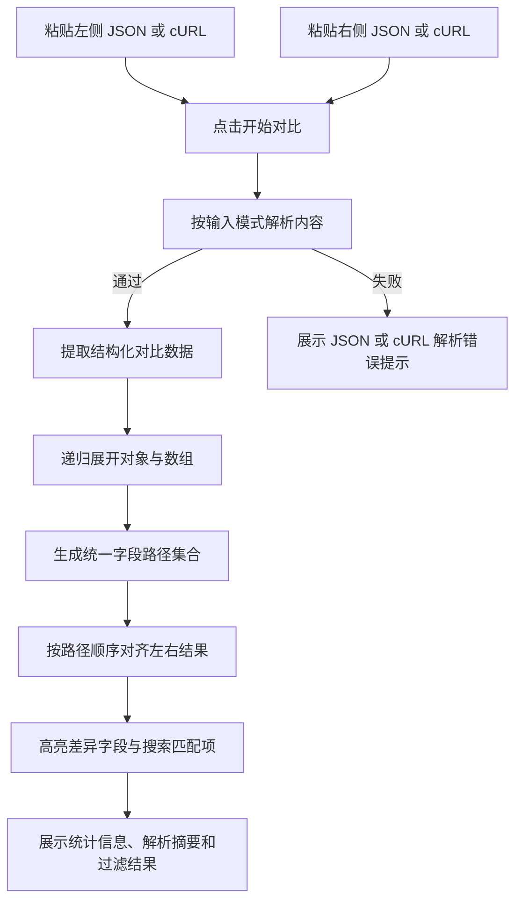

## 1. 产品概述
面向测试场景的前端提交字段快速对比工具，用于粘贴两组 JSON 或 cURL 请求数据并高效识别字段差异。
- 解决测试过程中手动比对字段名、字段值、嵌套结构和请求载荷来源效率低、容易漏看的问题，目标用户为测试工程师与联调排查人员。
- 通过双栏对齐展示、差异高亮、字段搜索跳转与 cURL 自动解析，缩短派生策略、被动响应等场景下的数据分析时间。

## 2. 核心功能

### 2.1 功能模块
1. **对比工作台**：左右粘贴输入区、输入格式选择、一键对比、示例填充、清空数据。
2. **差异结果区**：左右结果面板、字段路径展示、字段值展示、差异高亮。
3. **复杂结构处理**：支持对象与数组嵌套、结构扁平化、字段路径对齐。
4. **结果辅助能力**：差异统计、仅看差异过滤、字段搜索定位、JSON/cURL 解析错误提示。
5. **cURL 对比扩展**：支持直接粘贴 cURL、支持 cURL 与 JSON 相互对比、展示解析出的请求信息与提取结果。

### 2.2 页面详情
| 页面名称 | 模块名称 | 功能描述 |
|-----------|-------------|---------------------|
| 对比工作台 | 左侧输入区 | 支持直接粘贴左侧 JSON 或 cURL 字段数据，支持输入模式选择与格式校验 |
| 对比工作台 | 右侧输入区 | 支持直接粘贴右侧 JSON 或 cURL 字段数据，支持输入模式选择与格式校验 |
| 对比工作台 | 操作工具栏 | 提供一键对比、填充示例、清空、仅看差异开关 |
| 对比工作台 | 搜索工具栏 | 提供字段搜索、模糊搜索/精确匹配切换、上一项/下一项跳转 |
| 对比工作台 | 结果左面板 | 展示左侧字段路径与字段值，对差异字段使用醒目背景色标注 |
| 对比工作台 | 结果右面板 | 展示右侧字段路径与字段值，对差异字段使用醒目背景色标注 |
| 对比工作台 | 对齐对比区 | 相同路径字段上下位置保持一致，缺失字段显示占位内容 |
| 对比工作台 | 状态信息区 | 展示总字段数、差异字段数、解析错误信息 |
| 对比工作台 | 解析摘要区 | 展示 cURL 解析出的请求方法、URL、参数数量、body 提取来源 |

## 3. 核心流程
用户将两组前端提交字段数据或 cURL 命令粘贴到左右输入框中，选择对应输入模式后点击“开始对比”。系统先解析 JSON 或 cURL，提取可用于对比的结构化数据；若为 cURL，则自动提取请求方法、URL、参数和 body 中的 JSON/结构化参数。随后系统对嵌套对象和数组进行递归扁平化，生成稳定字段路径列表，按统一字段路径顺序将左右数据对齐展示，并对值不同、类型不同、单侧缺失的字段进行高亮标记。字段路径展示优先使用业务顶级字段名，像 `data_dict.spc_upgrade_mode` 这类历史包裹路径会自动归一化为 `spc_upgrade_mode`，同时保留旧路径输入兼容。用户还可以通过字段搜索快速定位匹配项，并在模糊搜索或精确匹配之间切换。

## 4. 用户界面设计
### 4.1 设计风格
- 主色为深色中性背景配合蓝青色强调色，差异字段使用高对比暖色背景。
- 按钮采用圆角、轻阴影与悬停高亮风格，强调“开始对比”主操作。
- 字体使用等宽字体展示 JSON 与字段值，正文使用清晰的无衬线字体。
- 布局采用桌面优先的双列工作台，上方输入、中部控制与搜索、下方结果，结果区左右严格对称。
- 图标使用简洁线性图标，突出输入、校验、差异、过滤等操作。

### 4.2 页面设计概览
| 页面名称 | 模块名称 | UI 元素 |
|-----------|-------------|-------------|
| 对比工作台 | 顶部说明区 | 工具标题、用途描述、差异统计卡片 |
| 对比工作台 | 输入编辑区 | 双文本域、输入模式切换、格式化占位文案、错误提示、操作按钮 |
| 对比工作台 | 过滤工具栏 | 仅看差异开关、字段数量摘要、操作反馈 |
| 对比工作台 | 搜索工具栏 | 搜索输入框、模糊/精确匹配切换、结果数与跳转按钮 |
| 对比工作台 | 解析摘要区 | cURL 请求方法、URL、头信息数量、参数来源与提取状态 |
| 对比工作台 | 结果对比区 | 左右并排卡片、字段路径标签、值面板、差异底色、缺失占位 |

### 4.3 响应式设计
- 桌面优先，宽屏下采用左右双栏输入与左右双栏结果布局。
- 中等屏幕下保持双栏结果，适度压缩边距与字体尺寸。
- 窄屏下输入区与结果区改为纵向堆叠，仍保持每一行左右字段成对显示。
