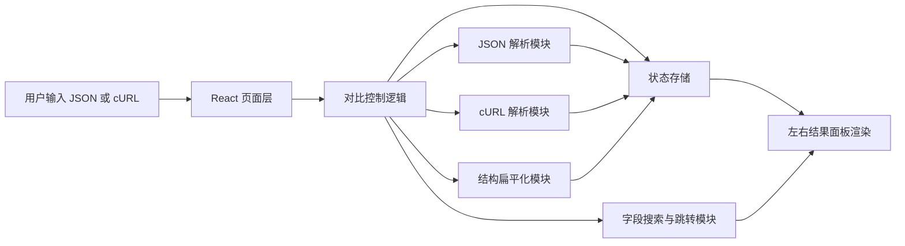
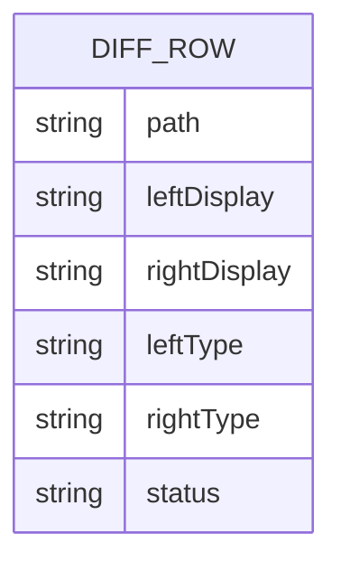

## 1. 架构设计
前端采用单页 React 应用，本地完成 JSON/cURL 解析、结构扁平化、差异计算与字段搜索，无需后端服务。



## 2. 技术说明
- 前端：React@18 + TypeScript + Vite + Tailwind CSS
- 初始化工具：vite-init
- 状态管理：zustand
- 测试：Vitest + React Testing Library
- 图标：lucide-react

## 3. 路由定义
| 路由 | 用途 |
|-------|---------|
| / | JSON 字段快速对比主页面 |

## 4. API 定义
本工具无需后端 API，所有输入解析与对比逻辑均在浏览器本地执行。

核心前端类型定义如下：

```ts
type InputMode = "auto" | "json" | "curl";
type ResolvedInputFormat = "json" | "curl";

type DiffStatus = "same" | "changed" | "missing-left" | "missing-right" | "type-changed";

type DiffRow = {
  path: string;
  leftDisplay: string;
  rightDisplay: string;
  leftType: string;
  rightType: string;
  status: DiffStatus;
};

type ParsedInputMeta = {
  resolvedFormat: ResolvedInputFormat;
  compareSource: "json" | "curl-body-json" | "curl-query" | "curl-form";
  method?: string;
  url?: string;
  queryCount: number;
  headerCount: number;
};
```

## 5. 数据模型
### 5.1 数据模型定义


### 5.2 前端处理策略
1. 将左右 JSON 分别解析为对象。
2. 若输入模式为 cURL，则先解析命令、请求方法、URL、headers、query 和 data，并提取可结构化的 JSON 或参数对象作为对比目标。
3. 通过递归遍历对象和数组，生成稳定路径，例如 `payload.items[0].id`。
4. 对字段路径做业务层归一化，优先使用顶级字段路径；若命中 `data_dict.*` 旧结构，则自动映射到对应业务字段，例如 `data_dict.spc_upgrade_mode -> spc_upgrade_mode`。
5. 合并左右路径并排序，保证相同字段上下位置一致。
6. 对每个路径生成结果行，比较字段值序列化结果与类型。
7. 对缺失字段、类型变化、值变化分别给出不同状态与样式。
8. 基于结果行路径提供模糊搜索和精确匹配，并支持当前匹配项的滚动定位，同时兼容旧路径别名输入。

## 6. 实现约束
- 仅处理合法 JSON 输入，不支持 JSON5。
- cURL 解析需支持常见的 `-X`、`-H`、`--url`、`-d/--data/--data-raw/--data-binary/--data-urlencode`、多行反斜杠续行和单/双引号格式。
- 结果展示必须保留字段路径和对应值，不以纯文本 diff 代替结构化对比。
- 大字段值使用多行展示，必要时折行但不得打乱左右对应关系。
- 默认展示全部字段，可切换仅看差异模式提升测试效率。
- 字段搜索默认按路径执行模糊匹配，并支持精确匹配路径或末级字段名。
- cURL 中若未提取到结构化 JSON/参数数据，需要提供明确、友好的错误提示。
