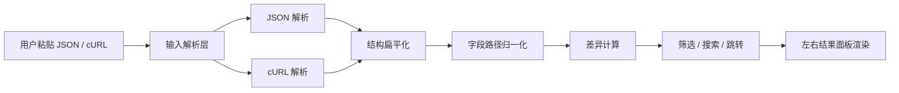
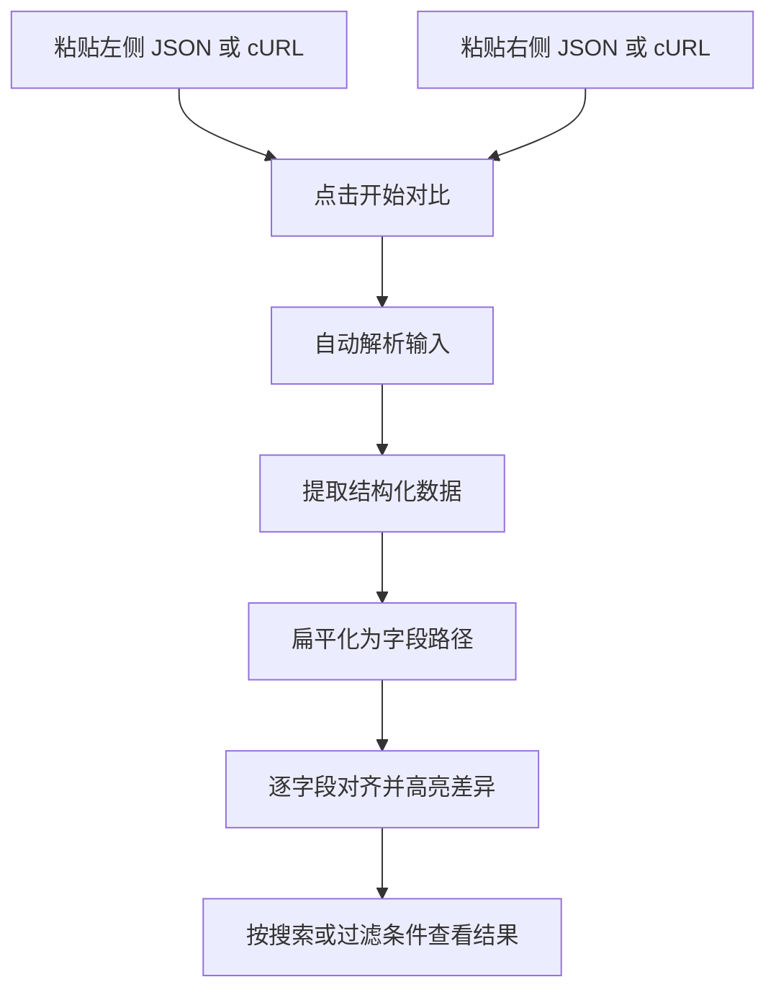

# 前端提交字段快速对比工具

一个面向测试、联调和排障场景的本地字段对比工作台。项目支持直接粘贴两组 JSON 或 cURL 请求，自动提取可对比数据并按字段路径逐行对齐，帮助你快速识别请求载荷中的字段差异、缺失项和类型变化。

## 目录

- [项目介绍](#项目介绍)
- [功能特性](#功能特性)
- [技术栈](#技术栈)
- [快速开始](#快速开始)
- [使用说明](#使用说明)
- [项目结构](#项目结构)
- [API 文档](#api-文档)
- [部署指南](#部署指南)
- [贡献指南](#贡献指南)
- [许可证信息](#许可证信息)
- [联系方式和致谢](#联系方式和致谢)

## 项目介绍

### 项目是什么

这是一个基于 React + TypeScript + Vite 构建的前端请求字段对比工具，专门用于比较两组前端提交数据中的结构和字段差异。

### 解决了什么问题

在测试、联调和问题排查过程中，经常会遇到这些痛点：

- 两组请求字段嵌套很深，人工逐层展开效率低
- cURL 与 JSON 混合对比时，需要手动提取 body 才能继续分析
- 字段顺序不一致时，肉眼难以快速看出真实差异
- 某些字段只关心少数路径，没必要被海量无关字段干扰
- 调试时需要重复切换“仅看差异”“仅看相同”“字段搜索”等视图

本项目将这些流程统一收敛到一个浏览器本地工作台中处理，无需后端服务。

### 主要特点和优势

- 支持 `JSON vs JSON`、`cURL vs JSON`、`cURL vs cURL`
- 自动解析 cURL，并优先提取请求体中的结构化数据参与对比
- 按字段路径逐行对齐展示，支持复杂嵌套对象和数组
- 差异字段高亮，缺失字段明确标注
- 支持字段搜索、模糊/精确匹配、匹配跳转
- 支持单选、多选和手动输入字段路径过滤
- 支持字段名简化显示、左右面板自定义命名、历史记录恢复
- 所有解析和对比逻辑都在浏览器本地运行

### 架构概览



### 界面预览

> 截图占位：在这里插入项目首页总览图\
> 建议文件路径：`docs/images/home-overview.png`\
> 建议展示内容：顶部说明区、左右输入面板、字段筛选、搜索栏、结果区、右侧模块导航

## 功能特性

### 核心功能

- 双面板输入与对比：左右分别粘贴两组待比对内容
- 差异高亮：值变化、类型变化、单侧缺失均有明确状态
- 叶子节点对比：深层嵌套结构会展开为逐字段结果，而不是整块对象比对
- cURL 自动解析：支持常见 `-H`、`-X`、`--data-raw` 等写法
- 请求体优先：对广告创建等真实 cURL 场景，优先提取 body JSON 作为对比目标
- 解析摘要：展示输入来源、请求方法、URL、Header 数量、Query 数量、Body 长度
- 字段搜索：按路径模糊匹配或精确匹配，并支持上下跳转
- 字段过滤：支持单选、多选和手动输入字段路径联合过滤
- 路径兼容：兼容 `data_dict.*` 旧路径和顶级业务字段路径
- 字段名显示切换：完整路径 / 最后一级简化展示
- 历史记录：自动保存对比历史，可回放
- 自定义命名：左右面板支持命名并持久化到本地
- 页面导航：右侧折叠导航支持快速定位主要模块

### 交互体验相关特性

- 搜索栏顶部吸附，滚动时保持可见
- 侧边导航默认折叠，悬停稳定展开
- 输入框保留常见原生编辑快捷键，如全选、复制、撤销、重做
- 支持“仅看差异”和“仅看相同”切换

### 适用场景

- 前端接口改版前后字段对比
- 测试阶段验证派生策略、被动响应和复杂嵌套提交结构
- 分析广告创建类 cURL 请求中的 payload 差异
- 调试线上问题时快速确认某个字段是否缺失、类型是否变化

## 技术栈

### 编程语言与框架

- TypeScript
- React 18
- Vite 6

### UI 与状态管理

- Tailwind CSS
- Zustand
- Lucide React
- `clsx` + `tailwind-merge`

### 测试与工程化

- Vitest
- React Testing Library
- JSDOM
- ESLint
- PostCSS
- `vite-tsconfig-paths`

### 项目配置要点

- 使用 `@/*` 指向 `src/*` 的路径别名
- `vite build` 默认输出隐藏 sourcemap
- Tailwind 采用类名驱动样式，扫描 `src/**/*.{js,ts,jsx,tsx}`

## 快速开始

### 环境要求

- Node.js `>= 20`，推荐使用较新的 LTS 版本
- npm `>= 10`

### 安装步骤

```bash
npm install
```

### 本地启动

```bash
npm run dev
```

默认情况下，Vite 会启动在本地端口，例如 `http://127.0.0.1:5173/`。如果端口被占用，会自动尝试下一个可用端口。

### 生产构建

```bash
npm run build
```

### 本地预览构建结果

```bash
npm run preview
```

### 类型检查

```bash
npm run check
```

### 运行测试

```bash
npm test
```

### 配置说明

当前项目无需额外的后端环境变量或 `.env` 文件即可运行。所有输入解析、字段扁平化、差异计算和搜索跳转逻辑都在浏览器本地完成。

## 使用说明

### 使用流程



### 场景一：JSON 与 JSON 对比

1. 在左侧输入框粘贴第一组 JSON
2. 在右侧输入框粘贴第二组 JSON
3. 保持输入模式为 `自动识别` 或显式选择 `JSON`
4. 点击“开始对比”
5. 在结果区查看逐字段差异和统计卡片

示例：

```json
{
  "requestId": "REQ-LEFT",
  "payload": {
    "page": 1,
    "region": "CN"
  }
}
```

```json
{
  "requestId": "REQ-RIGHT",
  "payload": {
    "page": "1",
    "region": "SG"
  }
}
```

> 截图占位：插入 JSON 对比结果截图\
> 建议文件路径：`docs/images/usage-json-compare.png`\
> 建议展示内容：差异高亮、类型变化、统计卡片

### 场景二：cURL 与 JSON 混合对比

1. 左侧粘贴完整 cURL 命令
2. 右侧粘贴 JSON
3. 点击“开始对比”
4. 工具会自动从 cURL 中提取可结构化的 body 或 query 参与对比
5. 在解析摘要区查看提取来源

示例：

```bash
curl 'https://example.com/api/search?scene=test' \
  -X POST \
  -H 'Content-Type: application/json' \
  --data-raw '{"requestId":"curl-left","payload":{"page":1}}'
```

```json
{
  "requestId": "json-right",
  "payload": {
    "page": 1
  }
}
```

> 截图占位：插入 cURL 解析摘要截图\
> 建议文件路径：`docs/images/usage-curl-parse.png`\
> 建议展示内容：请求来源、Method、URL、Header/Query 统计、提取的 JSON Body

### 场景三：仅查看指定字段

1. 先完成一次对比
2. 在“字段筛选”区域选择单选模式或多选模式
3. 勾选关注字段，或在手动输入框中输入字段路径
4. 结果区将只保留你指定的字段

示例手动输入：

```text
requestId, payload.page
strategy.rules[0].id
data_dict.spc_upgrade_mode
```

### 场景四：搜索并跳转字段

1. 在“结果搜索”区域输入字段路径
2. 按回车或点击“搜索”
3. 选择“模糊搜索”或“精确匹配”
4. 使用上下按钮切换匹配项

搜索框示例：

```text
payload.page
```

> 截图占位：插入搜索栏吸附效果截图\
> 建议文件路径：`docs/images/usage-sticky-search.png`\
> 建议展示内容：滚动到结果区后搜索栏吸附在顶部、匹配计数与跳转按钮

### 场景五：历史记录与面板命名

1. 点击左右输入面板标题处名称进行编辑
2. 执行对比后，历史记录会保存输入、结果摘要和自定义名称
3. 点击“查看历史”可恢复某次对比内容

> 截图占位：插入历史记录侧栏截图\
> 建议文件路径：`docs/images/usage-history-drawer.png`\
> 建议展示内容：历史卡片、左右面板自定义名称、恢复按钮

## 项目结构

```text
.
├── .trae/documents/                # 需求与技术设计文档
├── src/
│   ├── components/                 # 复用 UI 组件
│   │   ├── DiffResults.tsx         # 结果区容器与顶部摘要
│   │   ├── FieldSelector.tsx       # 字段选择与手动输入
│   │   ├── HistoryDrawer.tsx       # 历史记录抽屉
│   │   ├── InputMetaCard.tsx       # 解析摘要卡片
│   │   ├── JsonInputPanel.tsx      # 左右输入面板
│   │   ├── ResultCell.tsx          # 单行字段结果卡片
│   │   ├── SearchToolbar.tsx       # 结果搜索栏
│   │   ├── SectionNavigator.tsx    # 页面模块导航
│   │   └── StatCard.tsx            # 顶部统计卡片
│   ├── pages/
│   │   ├── Home.tsx                # 主页面编排
│   │   ├── Home.test.tsx           # 页面功能回归测试
│   │   └── Home.editingShortcuts.test.tsx
│   ├── stores/
│   │   └── useDiffStore.ts         # Zustand 全局状态
│   ├── test/
│   │   └── setup.ts                # Vitest 全局测试基建
│   ├── utils/                      # 核心逻辑与工具函数
│   │   ├── inputParser.ts          # JSON / cURL 输入解析
│   │   ├── jsonDiff.ts             # 扁平化、对比、摘要
│   │   ├── fieldFilters.ts         # 字段过滤逻辑
│   │   ├── fieldPath.ts            # 路径归一化与兼容
│   │   ├── fieldSearch.ts          # 搜索与路径匹配
│   │   ├── fieldDisplayPath.ts     # 字段名简化显示
│   │   ├── compareHistory.ts       # 历史记录持久化
│   │   ├── panelNames.ts           # 面板命名持久化
│   │   └── editingShortcuts.ts     # 输入类快捷键保护
│   ├── App.tsx
│   ├── main.tsx
│   └── index.css
├── package.json
├── vite.config.ts
├── tailwind.config.js
├── postcss.config.js
└── README.md
```

### 关键模块说明

- `src/pages/Home.tsx`\
  页面入口，负责串联输入、筛选、搜索、统计、结果和导航。
- `src/stores/useDiffStore.ts`\
  统一管理输入内容、面板名称、历史记录、展示偏好和对比动作。
- `src/utils/inputParser.ts`\
  负责识别输入模式，并从 cURL 中提取 query、headers 和 body。
- `src/utils/jsonDiff.ts`\
  负责递归展开对象与数组，生成稳定路径并执行左右对比。
- `src/components/SearchToolbar.tsx`\
  负责结果搜索交互，支持回车确认、精确匹配、上下跳转。

## API 文档

### 说明

本项目不依赖后端 API。所有“接口”能力都体现在前端内部的解析和对比方法中。

### 输入模式

```ts
type InputMode = "json" | "curl" | "auto";
type ResolvedInputFormat = "json" | "curl";
type CompareSource = "json" | "curl-body-json" | "curl-query" | "curl-form";
```

### 主要数据结构

```ts
type ParsedInputMeta = {
  resolvedFormat: ResolvedInputFormat;
  compareSource: CompareSource;
  targetLabel: string;
  method?: string;
  url?: string;
  queryCount: number;
  headerCount: number;
  bodyLength: number;
};

type DiffStatus =
  | "same"
  | "changed"
  | "missing-left"
  | "missing-right"
  | "type-changed";

type DiffRow = {
  path: string;
  leftDisplay: string;
  rightDisplay: string;
  leftType: string;
  rightType: string;
  status: DiffStatus;
};
```

### 主要处理入口

#### `parseComparableInput(raw, mode)`

用途：将原始字符串解析为可参与对比的结构化数据。

参数：

| 参数     | 类型          | 说明                               |
| ------ | ----------- | -------------------------------- |
| `raw`  | `string`    | 原始输入内容                           |
| `mode` | `InputMode` | 输入模式，支持 `json` / `curl` / `auto` |

返回示例：

```ts
{
  value: {
    requestId: "REQ-CURL-LEFT",
    payload: { page: 1 }
  },
  meta: {
    resolvedFormat: "curl",
    compareSource: "curl-body-json",
    targetLabel: "提取的 JSON Body",
    method: "POST",
    url: "https://example.com/api/search?scene=test",
    queryCount: 1,
    headerCount: 1,
    bodyLength: 45
  }
}
```

#### `compareJsonInputs(leftValue, rightValue)`

用途：对两组结构化数据执行逐字段对比。

返回示例：

```ts
{
  rows: [
    {
      path: "payload.page",
      leftDisplay: "1",
      rightDisplay: "\"1\"",
      leftType: "number",
      rightType: "string",
      status: "type-changed"
    }
  ],
  summary: {
    total: 1,
    same: 0,
    different: 1,
    missingLeft: 0,
    missingRight: 0,
    typeChanged: 1
  }
}
```

## 部署指南

### 构建产物

执行以下命令生成生产构建：

```bash
npm run build
```

构建完成后，静态文件位于 `dist/` 目录。

### 部署方式一：Nginx 静态部署

1. 执行 `npm run build`
2. 将 `dist/` 上传到服务器
3. 配置 Nginx 指向静态目录

示例配置：

```nginx
server {
  listen 80;
  server_name your-domain.com;

  root /var/www/json-diff-tool/dist;
  index index.html;

  location / {
    try_files $uri $uri/ /index.html;
  }
}
```

### 部署方式二：静态托管平台

该项目是纯前端 SPA，可直接部署到：

- Vercel
- Netlify
- GitHub Pages
- 任意支持静态文件托管的内部平台

建议配置：

- Build Command: `npm run build`
- Output Directory: `dist`

### 生产部署检查清单

- 确认 `npm run build` 本地通过
- 确认浏览器端不依赖私有后端 API
- 确认部署路径支持 SPA 回退到 `index.html`
- 如需 sourcemap，请根据团队策略调整 `vite.config.ts`

## 贡献指南

欢迎通过 Issue、PR 或内部协作方式改进项目。

### 建议的贡献流程

1. Fork 或新建功能分支
2. 阅读现有 README、PRD 和技术文档
3. 按现有代码风格完成修改
4. 补充或更新测试
5. 提交 PR，并说明改动背景、实现方式和验证结果

### 本地开发建议

- 提交前至少执行：

```bash
npm run check
npm test
npm run build
```

- 优先复用现有工具函数和状态管理模式
- 保持改动范围集中，避免无关重构
- 对复杂解析逻辑优先补单元测试

### 推荐提交信息示例

```text
feat: support manual field input for diff filtering
fix: restore sticky behavior for search toolbar
test: add regression cases for curl body extraction
```

## 许可证信息

当前仓库 **未包含明确的 LICENSE 文件**，因此 README 不对外宣称任何具体开源许可证。

如果你计划将该项目公开开源，建议补充以下之一：

- MIT License
- Apache-2.0 License
- BSD-3-Clause License

在许可证正式落库前，更稳妥的表述是：**许可证待补充，请勿默认按开源协议使用。**

## 联系方式和致谢

### 联系方式

当前仓库中未显式声明作者或维护者信息，建议补充以下内容：

- 作者：`Shutan Ye`
- 维护者：`Shutan Ye`
- 邮箱：`306888470@qq.com`

### 致谢

感谢以下开源项目和工具：

- [React](https://react.dev/)
- [Vite](https://vitejs.dev/)
- [TypeScript](https://www.typescriptlang.org/)
- [Tailwind CSS](https://tailwindcss.com/)
- [Zustand](https://zustand-demo.pmnd.rs/)
- [Vitest](https://vitest.dev/)
- [Testing Library](https://testing-library.com/)
- [Lucide](https://lucide.dev/)

***

如果你准备继续完善文档，建议下一步补上以下素材：

1. 首页总览截图
2. cURL 解析摘要截图
3. 搜索栏吸附效果截图
4. 历史记录抽屉截图
5. 一段 30 秒以内的操作录屏 GIF

